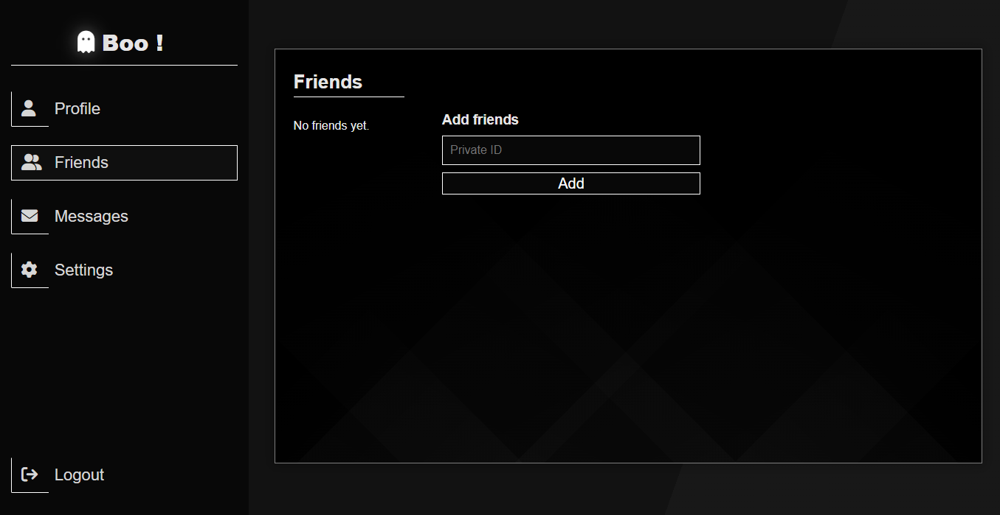
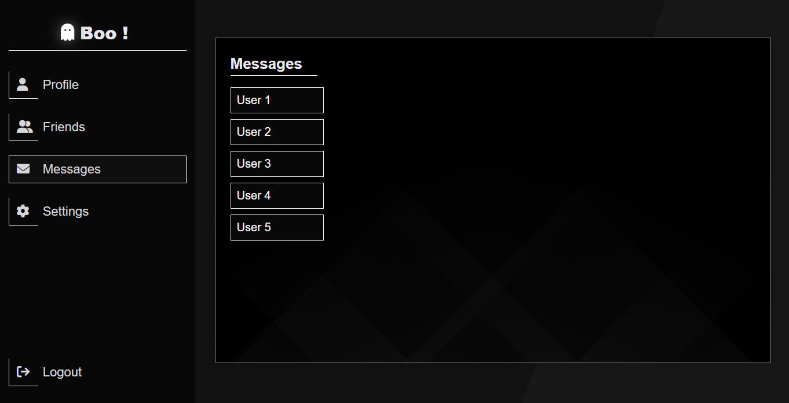
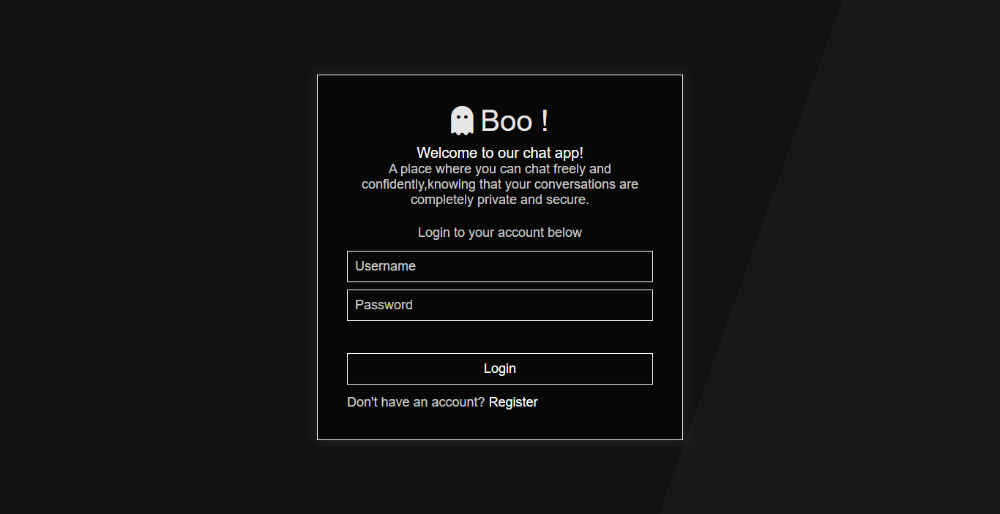
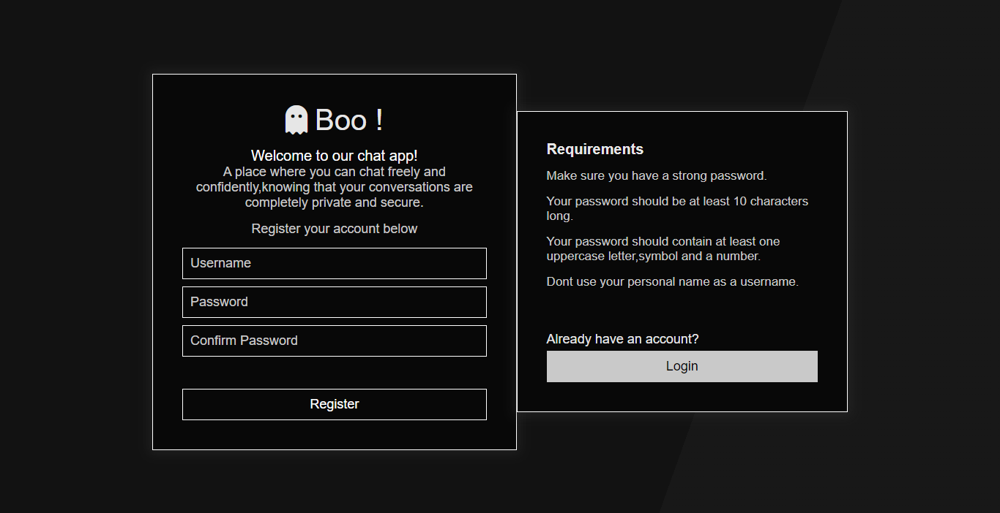
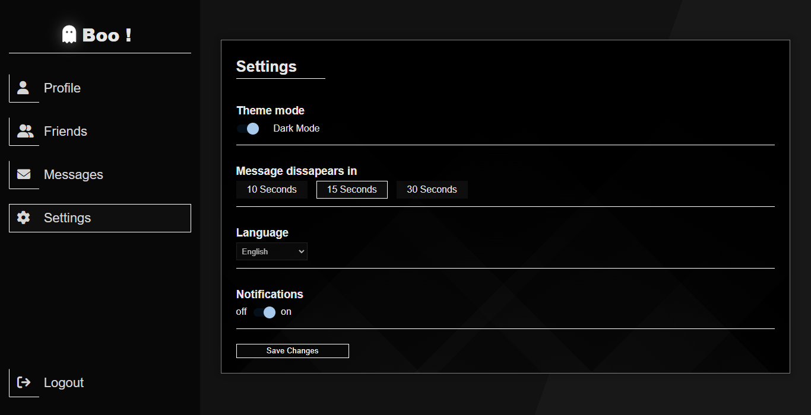

# Chat-App (Work in Progress)

## Description
Chat-App is a privacy-focused and anonymous chat application that aims to prioritize user control and security. The design follows a minimalistic and simple approach to provide an intuitive user experience. The key feature of the application is the automatic disappearance of messages after they have been seen, ensuring privacy and reducing data retention.

**Please note that this project is currently a work in progress.**

## Features (Planned)
- Minimalistic and user-friendly design for easy navigation and chat interaction.
- Automatic message disappearance: Messages will be deleted 10/15/30 seconds after they have been seen by the recipient.
- Localized chat: Emphasizes communication within local communities, ensuring enhanced security and control.
- QR code-based connections: Users can add each other to their contact lists by scanning QR codes, leaving no trace of the connection.
- Data privacy: Chats will not be saved, and messages will be deleted from both the database and the client after being read within a specific time interval, as requested by the user.

## Technologies Used (Planned)
- Frontend: HTML, CSS, JavaScript
- Backend: Nodejs, ExpressJS, Socket.IO
- Database: MongoDB

## Usage (Planned)
1. Clone or download the repository to your local machine.
2. Set up and configure the backend environment.
3. Run the application locally or deploy it to a web server.
4. Register or log in to access the chat interface.
5. Add contacts using QR codes for secure connections.
6. Engage in private and anonymous conversations with automatic message disappearance.

## Screenshots

